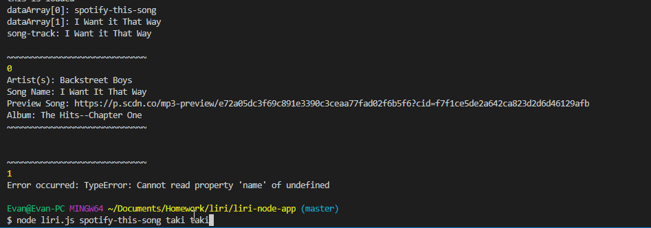

# liri-node-app
LIRI will search Spotify for songs, Bands in Town for concerts, and OMDB for movies. 

key.js export appears not to work; to circumvent this, process.env used inside liri.js 

spotify-this-song runs until the following error is encountered: ```Error occurred: TypeError: Cannot read property 'name' of undefined```
spotify-this-song also seems to not return "The Sign", but instead searchs for songs with "sign" incorporated in the query's response


